# Industrial Process Intelligence Platform

A modular Process Intelligence platform that transforms real Purchase-to-Pay event logs into operational KPIs, bottleneck insights, SLA and rework diagnostics, delay-cost estimates and prioritized improvement recommendations.

---

## One-Sentence Pitch

Eine Process-Intelligence-Plattform, die reale Purchase-to-Pay-Eventdaten analysiert, operative KPIs berechnet, Prozessvarianten erkennt, Bottlenecks priorisiert, SLA- und Rework-Risiken sichtbar macht und daraus konkrete Handlungsempfehlungen für Prozessverantwortliche ableitet.

---

## Business Problem

Unternehmen verfügen häufig über große Mengen an Prozessdaten aus ERP-, Einkaufs-, Service- oder Workflow-Systemen. Trotzdem bleiben zentrale operative Fragen oft unbeantwortet:

* Wo verliert der Prozess tatsächlich Zeit?
* Welche Prozessvarianten dominieren den operativen Ablauf?
* Welche Aktivitäten oder Übergänge verursachen Wartezeiten?
* Welche Fälle verfehlen definierte SLA-Ziele?
* Welche Aktivitäten erzeugen Rework-Schleifen?
* Welche Ursachen treiben lange Durchlaufzeiten?
* Welche Verbesserung sollte zuerst geprüft werden?

Klassische Reports zeigen meist aggregierte Kennzahlen. Dieses Projekt geht einen Schritt weiter und übersetzt Eventdaten in entscheidungsrelevante Prozessinformationen.

---

## Project Goal

Ziel des Projekts ist der Aufbau eines modularen Process-Intelligence-Prototyps für reale Purchase-to-Pay-Prozessdaten.

Das System soll Process Ownern, Operations-Verantwortlichen und Continuous-Improvement-Teams helfen, operative Schwachstellen zu erkennen und Verbesserungsmaßnahmen datenbasiert zu priorisieren.

Zentrale Leitfrage:

> Where does the Purchase-to-Pay process lose time, which process paths create operational risk, and which improvement action should be reviewed first?

---

## Target Users

* Process Owner
* Operations Manager
* Procurement / Purchase-to-Pay Analysts
* Continuous Improvement Teams
* Business Analysts
* Digital Transformation Analysts
* Process Automation Analysts
* Process Intelligence Analysts

---

## Data Source

Das Projekt nutzt den **BPI Challenge 2019 Purchase-to-Pay Event Log**.

Der Datensatz beschreibt reale Einkaufsprozesse eines multinationalen Unternehmens und enthält Events aus einem Purchase-to-Pay-Prozess.

Verwendete Rohdaten:

| Attribute      |           Value |
| -------------- | --------------: |
| Format         |   XES Event Log |
| Process Domain | Purchase-to-Pay |
| Events         |       1,595,923 |
| Raw Cases      |         251,734 |
| Activities     |              42 |
| Resources      |     approx. 628 |

Die Rohdaten werden aus Lizenz- und Speichergründen nicht im Repository gespeichert.

---

## Business Context

Der analysierte Purchase-to-Pay-Prozess besteht vereinfacht aus folgenden Schritten:

```text
Purchase Requisition
↓
Purchase Order
↓
Goods Receipt
↓
Invoice Receipt
↓
Invoice Clearing / Payment
```

Das Projekt untersucht, wie sich reale Prozesspfade, Wartezeiten, Ausnahmen, SLA-Verletzungen und Rework-Muster entlang dieses Prozesses verhalten.

---

## Key Findings

Die zentrale Erkenntnis des Projekts ist:

```text
Record Invoice Receipt → Clear Invoice
```

Dieser Prozessübergang ist gleichzeitig:

* Top Bottleneck
* Top Recommendation Focus Area
* Top Estimated Delay-Cost Driver

| Finding                       |                                 Result |
| ----------------------------- | -------------------------------------: |
| Top Bottleneck                | Record Invoice Receipt → Clear Invoice |
| Median Wait                   |                             36.17 days |
| P90 Wait                      |                             91.04 days |
| Estimated Delay Cost          |                 589,559,708 cost units |
| Share of Estimated Delay Cost |                                 33.84% |
| Total Estimated Delay Cost    |               1,742,253,372 cost units |
| SLA Compliance Rate           |                                 87.23% |
| SLA Breach Rate               |                                 12.77% |
| Rework Case Share             |                                  8.87% |
| Rework Cycle-Time Impact      |                    approx. +25.17 days |
| Distinct Process Variants     |                                 11,024 |
| Top 10 Variant Coverage       |                                 59.51% |
| Top 25 Variant Coverage       |                                 73.72% |

Cost values are not actual financials. They use a transparent assumption of **100 cost units per waiting day**.

---

## Dashboard Preview

### Executive Overview

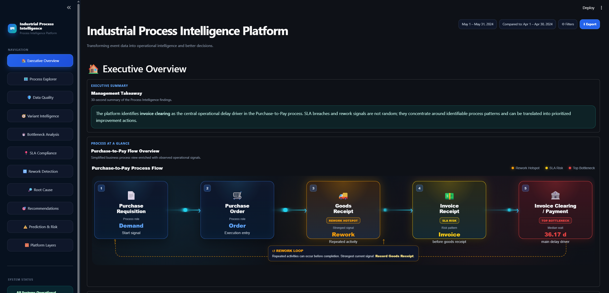

### Process Explorer

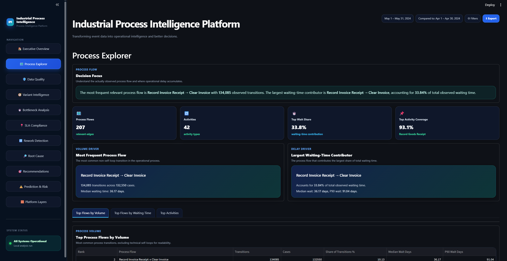

### Bottleneck Analysis

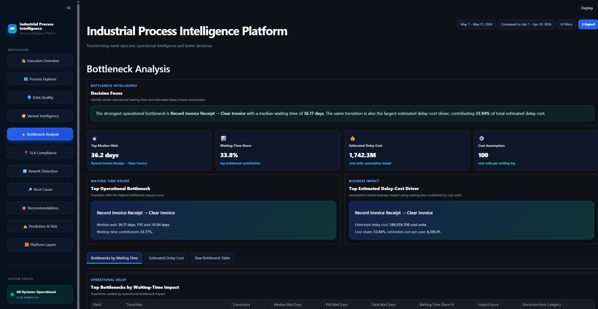

### SLA Compliance

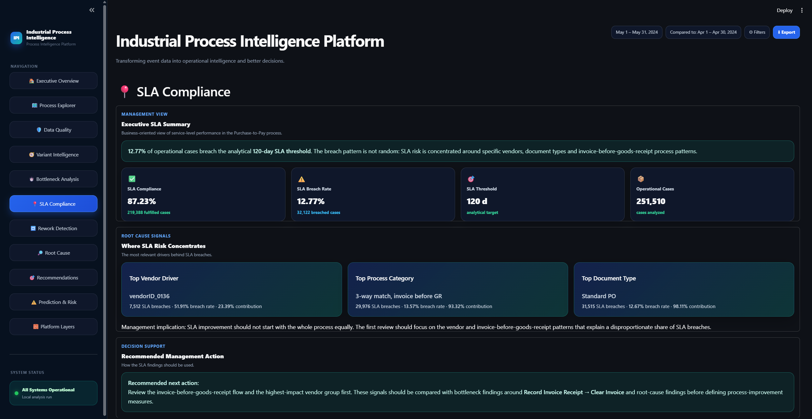

### Rework Detection

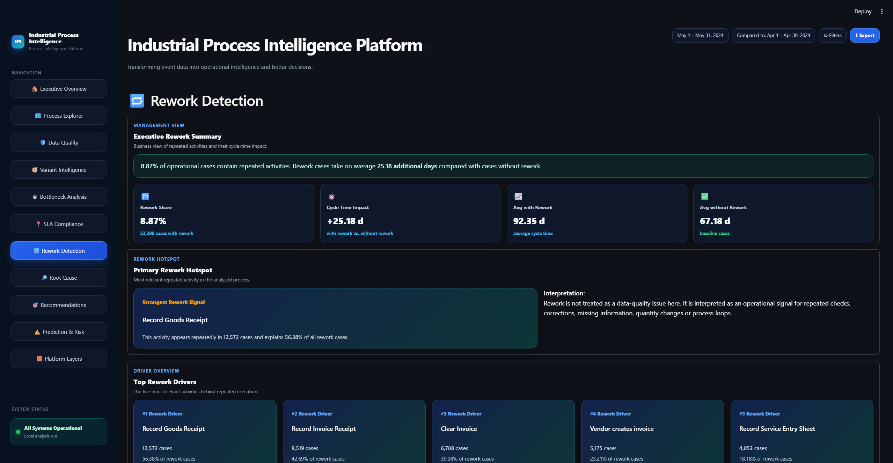

### Recommendations

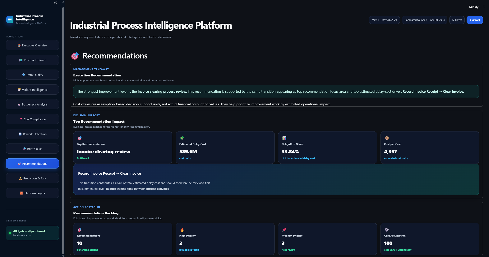

### Data Quality

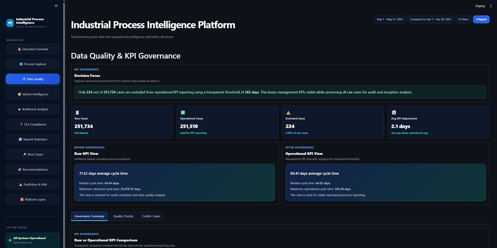

### Variant Intelligence

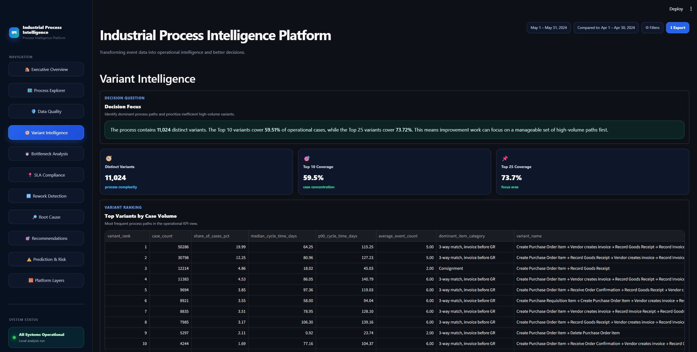

### Root Cause Analysis

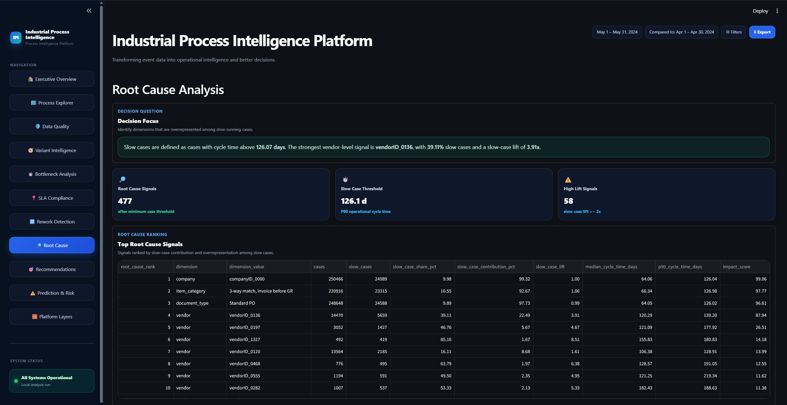

### Prediction & Risk

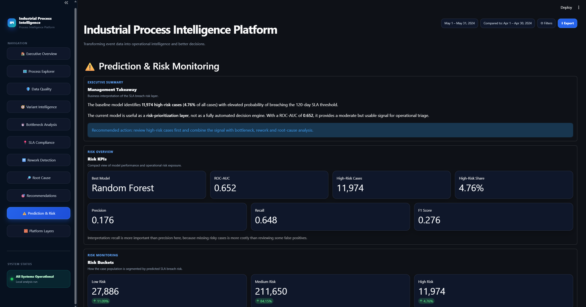

### Platform Layers

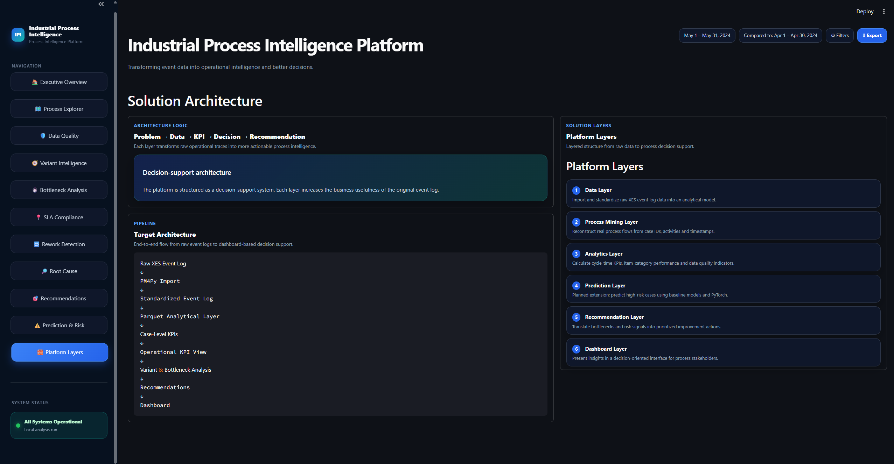

---

## Platform Logic

The platform follows a simple decision-support logic:

```text
Problem
→ Data
→ Analysis
→ KPI / Score
→ Decision
→ Recommendation
→ Presentation
```

The goal is not to build a generic dashboard. The goal is to identify where the Purchase-to-Pay process loses operational efficiency and which improvement area should be reviewed first.

---

## Architecture Overview

```text
Raw Event Log
    ↓
XES Import & Standardization
    ↓
Local Analytical Layer
    ↓
Case-Level KPI Layer
    ↓
Process Intelligence Modules
    ↓
Recommendation Layer
    ↓
Streamlit Decision-Support Dashboard
```

The project uses a local analytical architecture based on Python and Parquet files. This keeps the system transparent, reproducible and easy to run locally without cloud infrastructure.

---

## Core Modules

### 1. Data Ingestion & Standardization

The raw XES event log is converted into a structured analytical event table.

Main tasks:

* Load raw XES event log
* Standardize case, activity and timestamp columns
* Preserve relevant process attributes
* Store output as local Parquet file

Output:

```text
data/processed/event_log.parquet
```

---

### 2. KPI Governance & Data Quality

The platform separates raw process data from operational KPI reporting.

Extreme long-running cases are excluded from operational KPI reporting but remain available for exception and audit analysis.

Operational KPI rule:

```text
cycle_time_days <= 365
```

Result:

| KPI                           |       Value |
| ----------------------------- | ----------: |
| Raw Cases                     |     251,734 |
| Operational Cases             |     251,510 |
| Excluded Cases                |         224 |
| Operational Median Cycle Time |  64.02 days |
| Operational Max Cycle Time    | 364.38 days |

This avoids distorted management KPIs while preserving transparency.

---

### 3. Process Explorer

The Process Explorer analyzes activity transitions and activity coverage.

It answers:

* Which transitions occur most frequently?
* Which transitions contribute most waiting time?
* Which activities dominate the process?
* Where does the process flow concentrate?

Outputs:

```text
data/processed/process_edges.parquet
data/processed/process_activities.parquet
```

Important note:

Self-loops are retained in the analytical output but are de-emphasized in the dashboard interpretation to keep the management view readable.

---

### 4. Variant Intelligence

Variant Intelligence groups cases by process path.

It answers:

* How many distinct process variants exist?
* Which variants dominate the process?
* How much volume is covered by the top variants?
* Which paths are operationally relevant?

Results:

| Metric                  |  Value |
| ----------------------- | -----: |
| Distinct Variants       | 11,024 |
| Top 10 Variant Coverage | 59.51% |
| Top 25 Variant Coverage | 73.72% |

Top variant:

```text
Create Purchase Order Item
→ Vendor creates invoice
→ Record Goods Receipt
→ Record Invoice Receipt
→ Clear Invoice
```

---

### 5. Bottleneck Analysis

The Bottleneck Analysis calculates waiting times between process activities.

It answers:

* Which transitions create the largest waiting-time contribution?
* Which transitions have high median and P90 waiting times?
* Which bottlenecks affect many cases?
* Which bottleneck should be reviewed first?

Top bottleneck:

```text
Record Invoice Receipt → Clear Invoice
```

| Metric                 |                          Value |
| ---------------------- | -----------------------------: |
| Transition Count       |                        134,085 |
| Median Wait            |                     36.17 days |
| P90 Wait               |                     91.04 days |
| Total Waiting Time     |              5,895,597.08 days |
| Dominant Item Category | 3-way match, invoice before GR |

Output:

```text
data/processed/bottleneck_analysis.parquet
```

---

### 6. Delay-Cost Estimate

The Delay-Cost module translates waiting time into an assumption-based business impact estimate.

Formula:

```text
estimated_delay_cost = total_waiting_time_days × assumed_cost_per_waiting_day
```

Assumption:

```text
100 cost units per waiting day
```

Result:

| Metric                     |                                  Value |
| -------------------------- | -------------------------------------: |
| Estimated Total Delay Cost |               1,742,253,372 cost units |
| Top Delay-Cost Driver      | Record Invoice Receipt → Clear Invoice |
| Top Driver Estimated Cost  |                 589,559,708 cost units |
| Top Driver Cost Share      |                                 33.84% |

This is not a financial accounting model. It is a transparent decision-support estimate to compare operational improvement priorities.

Output:

```text
data/processed/delay_cost_estimate.parquet
```

---

### 7. SLA Compliance

The SLA module evaluates process cases against an analytical SLA threshold.

SLA rule:

```text
cycle_time_days <= 120
```

Results:

| Metric            |   Value |
| ----------------- | ------: |
| Operational Cases | 251,510 |
| SLA Fulfilled     | 219,388 |
| SLA Breached      |  32,122 |
| Compliance Rate   |  87.23% |
| Breach Rate       |  12.77% |

The module also breaks down SLA risk by process attributes such as vendor, company, document type and item category.

Outputs:

```text
data/processed/sla_metrics.parquet
data/processed/sla_breakdown.parquet
```

---

### 8. Rework Detection

The Rework module detects repeated activities within cases.

It answers:

* How many cases contain repeated activities?
* Which activities create the most rework?
* How much longer are rework cases compared with non-rework cases?
* Which rework pattern should be reviewed first?

Results:

| Metric                        |               Value |
| ----------------------------- | ------------------: |
| Operational Cases Analyzed    |             251,510 |
| Cases with Rework             |              22,298 |
| Rework Case Share             |               8.87% |
| Avg Cycle Time without Rework |          67.18 days |
| Avg Cycle Time with Rework    |          92.35 days |
| Cycle-Time Impact             | approx. +25.17 days |

Top rework activity:

```text
Record Goods Receipt
```

Outputs:

```text
data/processed/rework_case_analysis.parquet
data/processed/rework_activity_analysis.parquet
```

---

### 9. Root Cause Analysis

The Root Cause module identifies structural signals associated with slow cases.

It answers:

* Which vendors, item categories or document types are overrepresented in slow cases?
* Which signals have high volume?
* Which signals have high lift?
* Which signals are actionable for management review?

Output:

```text
data/processed/root_cause_analysis.parquet
```

Important interpretation:

High-volume structural signals such as company or standard document type explain large parts of the dataset. More actionable signals often come from vendor- or category-level patterns.

---

### 10. Recommendation Layer

The Recommendation Layer combines evidence from bottleneck analysis, delay-cost estimates, SLA signals and rework diagnostics.

It answers:

* Which process issue should be reviewed first?
* What is the supporting evidence?
* Is the issue volume-driven, delay-driven, SLA-driven or rework-driven?
* What management action should be considered?

Top recommendation focus:

```text
Record Invoice Receipt → Clear Invoice
```

Reason:

```text
This transition is the top bottleneck, top delay-cost driver and top recommendation focus area.
```

Output:

```text
data/processed/recommendations.parquet
```

---

### 11. Prediction & Risk Layer

The Prediction & Risk module is treated as an optional analytical extension, not as the main value proposition of the project.

Objective:

```text
Baseline SLA breach risk prediction
```

Target:

```text
sla_breach = cycle_time_days > 120
```

Modeling approach:

* Logistic Regression baseline
* Random Forest baseline
* Case-level, non-leaking features
* Evaluation via classification metrics and feature importance

Outputs:

```text
data/processed/prediction_dataset.csv
outputs/ml/model_metrics.json
outputs/ml/risk_predictions.csv
outputs/ml/feature_importance.csv
outputs/ml/confusion_matrix.csv
```

The module is intentionally framed as a baseline model. It is not positioned as production AI.

---

## Dashboard Pages

The Streamlit dashboard contains the following views:

| Page                 | Purpose                                                    |
| -------------------- | ---------------------------------------------------------- |
| Executive Overview   | Management summary, key findings and process-at-a-glance   |
| Process Explorer     | Process flows, activity coverage and transition analysis   |
| Data Quality         | KPI governance, operational filter and data quality checks |
| Variant Intelligence | Process variants, volume concentration and path analysis   |
| Bottleneck Analysis  | Waiting-time analysis and delay-cost evidence              |
| SLA Compliance       | SLA fulfillment, breach rate and risk concentration        |
| Rework Detection     | Rework share, repeated activities and cycle-time impact    |
| Root Cause           | Slow-case signals and structural drivers                   |
| Recommendations      | Prioritized improvement backlog                            |
| Prediction & Risk    | Optional baseline SLA risk model                           |
| Platform Layers      | Architecture and analytical layer explanation              |

Each view is designed around the question:

> Which decision can the user make better after seeing this page?

---

## Tech Stack

| Area                        | Technology                      |
| --------------------------- | ------------------------------- |
| Programming                 | Python                          |
| Data Processing             | Pandas, NumPy                   |
| Process Mining / Event Logs | PM4Py                           |
| Dashboard                   | Streamlit                       |
| Machine Learning Baseline   | Scikit-learn                    |
| Storage Layer               | Parquet                         |
| Visualization / UI          | Streamlit components, HTML/CSS  |
| Validation                  | Custom Python validation script |
| Version Control             | Git, GitHub                     |

No cloud deployment, no Kubernetes, no React frontend and no unnecessary microservice architecture are used. The focus is analytical credibility, reproducibility and business value.

---

## Project Structure

```text
industrial-process-intelligence/
├── app/
│   └── streamlit_app.py
├── src/
│   └── dashboard/
│       ├── charts.py
│       ├── components.py
│       ├── data_access.py
│       ├── styles.py
│       └── views/
│           ├── __init__.py
│           ├── executive_overview.py
│           ├── data_quality.py
│           ├── process_explorer.py
│           ├── variant_intelligence.py
│           ├── bottleneck_analysis.py
│           ├── sla_compliance.py
│           ├── rework_detection.py
│           ├── root_cause.py
│           ├── recommendations.py
│           ├── prediction.py
│           └── platform_layers.py
├── scripts/
│   ├── 01_inspect_raw_xes.py
│   ├── 02_convert_xes_to_parquet.py
│   ├── 03_calculate_initial_kpis.py
│   ├── 04_create_clean_case_table.py
│   ├── 05_calculate_variant_analysis.py
│   ├── 06_calculate_bottlenecks.py
│   ├── 07_generate_recommendations.py
│   ├── 08_calculate_root_cause_analysis.py
│   ├── 09_validate_pipeline_outputs.py
│   ├── 10_calculate_sla_metrics.py
│   ├── 11_calculate_rework_detection.py
│   ├── 12_calculate_process_explorer.py
│   ├── 13_calculate_delay_cost_estimate.py
│   ├── 14_create_prediction_dataset.py
│   └── 15_train_baseline_model.py
├── data/
│   ├── raw/
│   ├── processed/
│   └── external/
├── outputs/
│   ├── screenshots/
│   └── ml/
├── requirements.txt
├── .gitignore
└── README.md
```

---

## Local Setup

### 1. Clone Repository

```bash
git clone https://github.com/jannis-holtz/industrial-process-intelligence.git
cd industrial-process-intelligence
```

### 2. Create Virtual Environment

Windows PowerShell:

```powershell
python -m venv .venv
.venv\Scripts\Activate.ps1
```

macOS / Linux:

```bash
python -m venv .venv
source .venv/bin/activate
```

### 3. Install Dependencies

```bash
pip install -r requirements.txt
```

---

## Data Setup

The raw BPI Challenge 2019 event log is not included in this repository.

Place the raw XES file in:

```text
data/raw/bpi_challenge_2019.xes
```

Then run the processing scripts in order.

---

## Pipeline Execution

Run the pipeline from the project root:

```bash
python scripts/02_convert_xes_to_parquet.py
python scripts/03_calculate_initial_kpis.py
python scripts/04_create_clean_case_table.py
python scripts/05_calculate_variant_analysis.py
python scripts/06_calculate_bottlenecks.py
python scripts/07_generate_recommendations.py
python scripts/08_calculate_root_cause_analysis.py
python scripts/10_calculate_sla_metrics.py
python scripts/11_calculate_rework_detection.py
python scripts/12_calculate_process_explorer.py
python scripts/13_calculate_delay_cost_estimate.py
python scripts/14_create_prediction_dataset.py
python scripts/15_train_baseline_model.py
python scripts/09_validate_pipeline_outputs.py
```

The validation script checks whether the required analytical outputs exist and whether the central KPI assumptions are consistent.

---

## Run Dashboard

```bash
streamlit run app/streamlit_app.py
```

The dashboard loads processed data from the local analytical layer under:

```text
data/processed/
```

Large generated data files are intentionally excluded from GitHub.

---

## Validation Output

Latest pipeline validation summary:

```text
=== Pipeline Validation Summary ===
Status: PASSED

Core outputs:
- Event log rows: 1,595,923
- Raw cases: 251,734
- Operational cases: 251,510
- Variants: 11,024
- Bottlenecks: 207
- Recommendations: 10
- Root cause signals: 477
- SLA breakdown signals: 1,956
- Rework case rows: 251,510
- Rework activities: 31
- Process edges: 207
- Process activities: 42
- Delay cost drivers: 207

Operational KPI checks:
- Raw median cycle time: 64.04 days
- Operational median cycle time: 64.02 days
- Operational max cycle time: 364.38 days

SLA checks:
- Analytical SLA threshold: 120 days
- SLA compliance rate: 87.23%
- SLA breach rate: 12.77%

Rework checks:
- Rework cases: 22,298
- Rework case share: 8.87%
- Top rework activity: Record Goods Receipt

Delay Cost checks:
- Assumed cost per waiting day: 100 cost units
- Estimated total delay cost: 1,742,253,372.00 cost units
- Top delay cost driver: Record Invoice Receipt → Clear Invoice
```

---

## Repository and Data Governance

The repository intentionally excludes:

```text
data/raw/
data/processed/
data/external/
outputs/ml/
.venv/
__pycache__/
large generated model outputs
raw XES event logs
```

This keeps the repository lightweight and avoids distributing large licensed datasets.

Screenshots under `outputs/screenshots/` are included to make the project understandable without running the dashboard locally.

---

## Security and Quality Considerations

Even though this is a portfolio project, the implementation follows professional engineering principles:

* No hardcoded secrets
* No API keys required
* Raw data separated from processed data
* Large generated files excluded from Git
* Modular dashboard views
* Cached data loading in Streamlit
* Reproducible pipeline scripts
* Explicit validation script
* Transparent KPI and cost assumptions
* Clear distinction between operational reporting and exception analysis

---

## Limitations

This project is a portfolio-grade analytical prototype, not a production system.

Known limitations:

* The delay-cost model uses an assumption-based cost value, not actual financial accounting data.
* The SLA threshold is analytical and not necessarily the original company's contractual SLA.
* The prediction module is a baseline risk layer and not a production-grade AI system.
* The dashboard runs locally and is not deployed as a managed enterprise application.
* The raw event log is not included due to size and licensing constraints.
* Some root-cause signals are structural high-volume signals and require business validation before operational action.

---

## Roadmap

Potential future extensions:

* Add interactive filters for vendor, item category and document type
* Add what-if simulation for bottleneck reduction scenarios
* Add comparison between baseline ML model and more advanced sequence model
* Add automated HTML or PDF management report export
* Add process owner action tracking for recommendations
* Add clearer separation between operational, exception and audit views

Not planned for the current MVP:

* Cloud deployment
* Kubernetes
* React frontend
* Neo4j graph database
* Transformer model
* Complex MLOps pipeline

These would add complexity without improving the current portfolio value significantly.

---

## Interview Pitch

### 30-Second Version

Ich habe eine Process-Intelligence-Plattform auf Basis eines realen Purchase-to-Pay-Eventlogs gebaut. Die Plattform bereitet über 1.5 Millionen Events auf, trennt operative KPI-Fälle von Ausreißern, erkennt Prozessvarianten, Bottlenecks, SLA-Verletzungen und Rework-Schleifen und leitet daraus priorisierte Handlungsempfehlungen ab. Der zentrale Befund ist, dass der Übergang von Invoice Receipt zu Clear Invoice gleichzeitig der größte Bottleneck, der wichtigste Recommendation-Fokus und der größte geschätzte Delay-Cost-Treiber ist.

### 2-Minute Business Version

Das Projekt analysiert einen realen Purchase-to-Pay-Prozess mit Process-Intelligence-Methoden. Zuerst werden Eventdaten standardisiert und in einen lokalen Parquet-Layer überführt. Danach werden operative KPI-Fälle definiert, extreme Ausreißer für KPI-Reporting ausgeschlossen, aber nicht aus der Analyse entfernt. Anschließend erzeugt die Pipeline Variant Intelligence, Bottleneck Analysis, SLA Compliance, Rework Detection, Root Cause Analysis und eine Delay-Cost-Schätzung. Das Dashboard übersetzt diese Module in Management-Sichten und zeigt, welche Prozessbereiche zuerst verbessert werden sollten. Besonders wichtig ist, dass mehrere unabhängige Module denselben Hauptbefund bestätigen: Record Invoice Receipt → Clear Invoice ist der zentrale Delay- und Improvement-Treiber.

### Technical Version

Technisch besteht das Projekt aus einer modularen Python-Pipeline mit Pandas, PM4Py, Parquet und Streamlit. Die Rohdaten werden standardisiert, Case-KPIs werden berechnet, Varianten werden aggregiert, Wartezeiten zwischen Aktivitäten werden bestimmt, SLA- und Rework-Signale werden case- und activity-basiert berechnet und eine transparente Delay-Cost-Schätzung wird aus total waiting time × cost assumption abgeleitet. Das Dashboard ist modular in einzelne Views aufgeteilt und nutzt gecachte Data Loader, um große Parquet-Dateien performant zu laden. Zusätzlich existiert ein Baseline-SLA-Risk-Modell mit Scikit-learn, das bewusst nur als optionaler Zusatz und nicht als Hauptwertversprechen kommuniziert wird.

---

## CV Bullet Points

* Developed a modular Process Intelligence platform for a real Purchase-to-Pay event log with 1.59M events, covering KPI governance, process variants, bottlenecks, SLA breaches, rework detection and root-cause signals.
* Built a Streamlit-based decision-support dashboard that translates process mining outputs into management-ready insights, including a Purchase-to-Pay flow overview, bottleneck analysis, SLA compliance, rework impact and prioritized recommendations.
* Implemented an assumption-based delay-cost model linking operational waiting time to estimated business impact, identifying Record Invoice Receipt → Clear Invoice as the top bottleneck and largest delay-cost driver with 33.84% cost share.
* Designed a recommendation layer that combines bottleneck, SLA, rework and delay-cost evidence into a prioritized improvement backlog for process owners.

---

## Project Status

The project is MVP-complete as a portfolio-grade Process Intelligence platform.

Completed:

* Event log ingestion
* Standardized analytical data layer
* Operational KPI governance
* Data quality checks
* Process explorer
* Variant intelligence
* Bottleneck analysis
* Delay-cost estimate
* SLA compliance analysis
* Rework detection
* Root cause analysis
* Recommendation layer
* Optional baseline SLA risk model
* Modular Streamlit dashboard
* Pipeline validation
* GitHub-ready repository structure

Main focus:

```text
Problem → Data → Analysis → KPI / Score → Decision → Recommendation → Presentation
```

The project demonstrates the ability to translate complex process data into business-oriented decision support.
